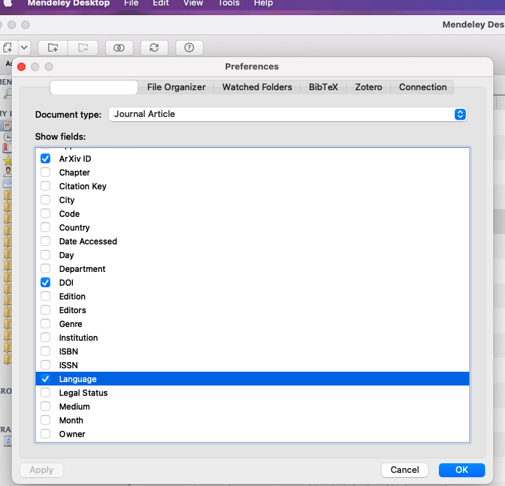
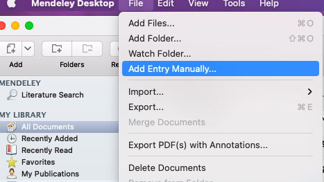
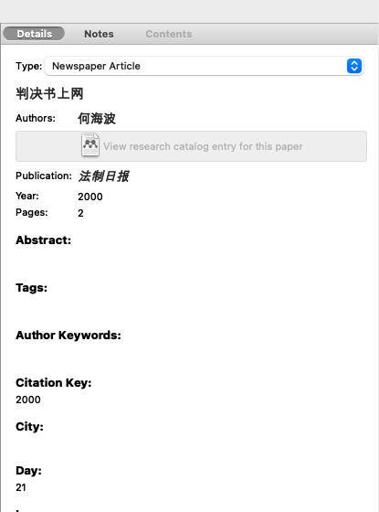
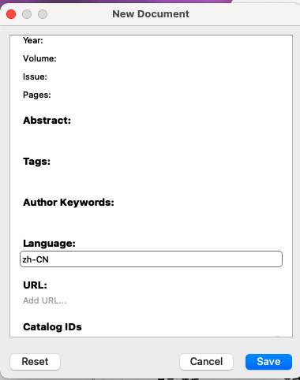
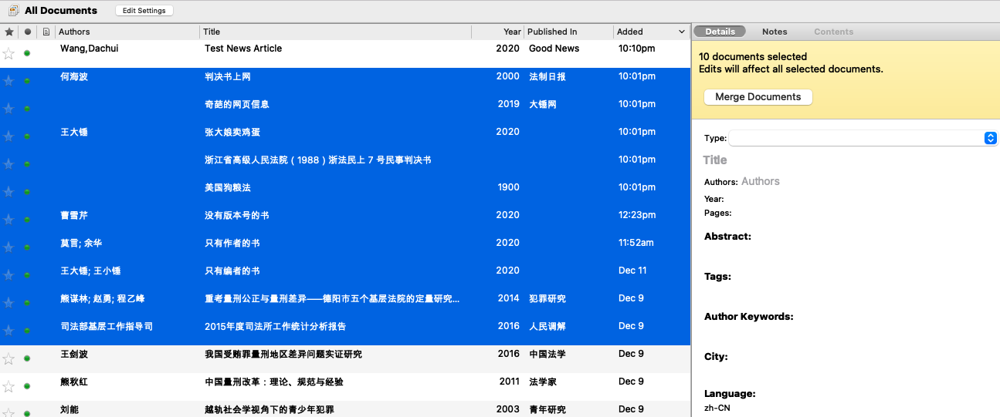
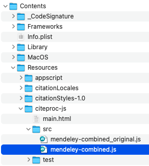
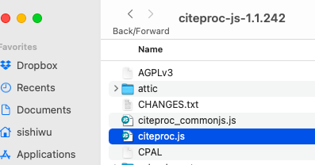
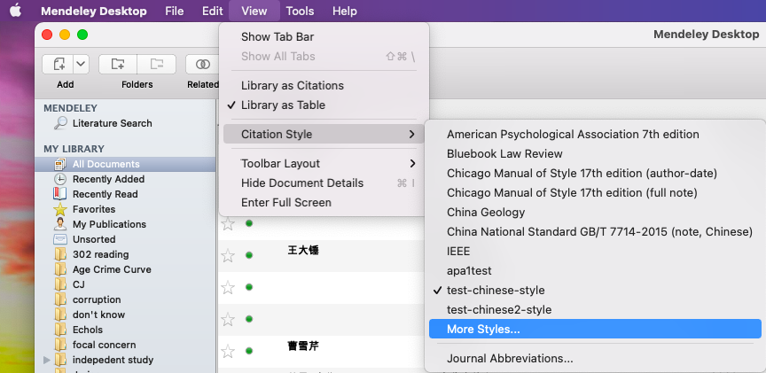
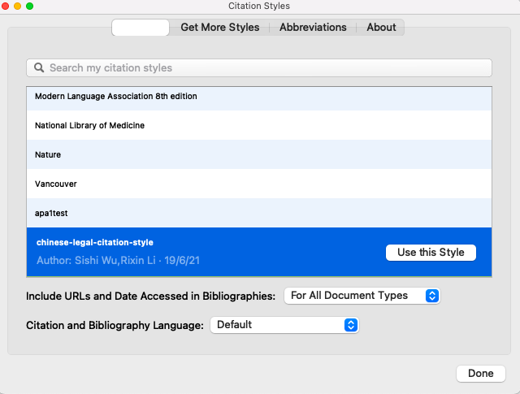
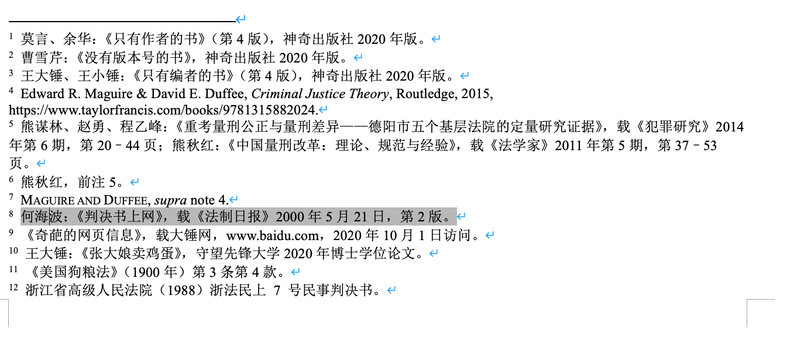

# Manual of legal citation(法学引注手册) in Mendeley

- If you are already a frequent Mendeley user, you can skip part 0, 1, 2, 3, and read only part 4 & 5.
- You can alway skip part 0 (it contains only personal notes)

---

- [0. Use Mendeley to manage citation](#0-use-mendeley-to-manage-citation)
  * [Why Mendeley](#why-mendeley)
  * [Use Mendeley](#use-mendeley)
- [1. Field manipulation](#1-field-manipulation)
- [2. Add Chinese entries](#2-add-chinese-entries)
- [3. Add English entries](#3-add-english-entries)
- [4. Update citeproc-js](#4-update-citeproc-js)
- [5. Use the new style](#5-use-the-new-style)

## 0. Use Mendeley to manage citation

### Why Mendeley

- Mendeley是免费、跨平台的
- 在现有的文献管理工具中，暂时没有包括《法学引注手册》体例的工具（网上有网友对一款国内的工具Noteexpress发起过[格式请求](http://www.inoteexpress.com/nesupport2/forum.php?mod=viewthread&tid=56778)，不知道Noteexpress是否已经更新，不过Noteexpress似乎不能在Mac上使用，所以不是一个可选项），因此需要自定义体例/customize style。由于《法学引注手册》体例需要囊括中英文，允许multilingual layout extension的免费工具只有Zotero的[Juris-M](https://forums.zotero.org/discussion/59837/combining-the-languages)，因为没有找到Juris-M自定义体例的方式，所以使用Mendeley来自定义体例。Mendeley使用的engine不支持multilingual layout，不过Juris-M的作者为Mendeley贡献了大量代码，两者engine有共通之处，通过一定的调整（第4部分所说的update citeproc-js）可以拿来用。

### Use Mendeley

- 关于Mendeley的教程网上一搜就有，很多人用Mendeley管理文献，不同人也有不同的使用习惯。

- 我个人不用Mendeley管理和阅读文献，我只用它来生成注释和参考文献，而且只手动输入文献信息/add entry manually（自动识别产生的文献信息可能不准确），在手动输入英文文献时的捷径是输入doi并点击lookup，通过doi识别的文献信息一般都很准确。但是，中文文献的doi在Mendeley中会显示lookup failed，因此需要手动输入中文文献的信息，不过这可以在阅读和整理文献过程中完成，不需要等到开始写作再进行。
- 即使有了自动生成格式的工具，有时候一些手动的编辑还是在所难免，但是，自动化工具将手动编辑的工作量减少到最小。

---


## 1. Field manipulation

1.1 Download and install Mendeley desktop from its official website [here](https://www.mendeley.com/download-desktop-new/)

1.2 Open Mendeley, from Mendeley desktop - **Tools**, click "install MS Word Plug-in"


1.3 Click "Mendeley desktop," then click  "**Preferences**," select each one of the **Document type**, under **Show fields**, check **DOI**, **Language**. Make sure these fields are checked for **every  Document type**



1.4 Also check Chapter, Date Accessed, Day, Edition, Editors, Genre, Month, and Publisher, if they have not been checked. 

## 2. Add Chinese entries

- from Mendeley desktop - File, click "Add Entry Manually," select proper **type** and enter all necessary information of your document manually, then click Save




- You can always see and edit the document information under **Details** on the right panel of Mendeley desktop




Normally the fields are quite self-explanatory, but you need to pay attention to the following if you want to use Manual of legal citation smoothly.

2.0 You should enter **zh-CN** in **Language** for all Chinese literature 

2.0 You should enter **zh-CN** in **Language** for all Chinese literature 

2.0 You should enter **zh-CN** in **Language** for all Chinese literature 




That is important and that can be done in a quicker way if you already have a lot of Chinese literature in Mendeley. You can just select all documents you need (i.e. all Chinese documents) and your edits wil affect all selected documents




2.1 If the document type is: **Book**

- for a book with only editors, you should enter editor names in **Authors**

2.2 If the document type is: **Newspaper Article**

- 报纸版次 should be entered in **Pages**
- 例如：《法制日报》第 2 版，在Pages处写2

2.3 If the document type is: **Thesis**

- 论文层次 should be entered in **Genre**
- University should be entered in **University** or **Publisher**
- 例如：中国政法大学 2015 年博士学位论文，在University或Publisher处写中国政法大学，在Genre处写博士学位论文

2.4 If the document type is: **Statute**

- 条款序数 should be entered in **Chapters**
- 例如：《民法总则》第 27 条第 2 款第 3 项，在Title处写民法总则，在Chapters处写第 27 条第 2 款第 3 项。

2.4 If the document type is: **Case**

- 案例名 should be entered in **Title**
- 例如：浙江省高级人民法院（1988）浙法民上 7 号民事判决书，在Title处写浙江省高级人民法院（1988）浙法民上 7 号民事判决书

## 3. Add English entries

3.1 Find the DOI of your document

- DOI looks like this: 10.1177/0887403412461501
- DOI can be found on the first page of the article
- If DOI cannot be found on the first page, use [this website](https://search.crossref.org) and enter the title of your article to search for the DOI

3.2 DOI lookup

- If you have the DOI, from Mendeley desktop - File, click "Add Entry Manually," enter DOI in the DOI field, click lookup, then click Save


- If DOI cannot be found or the document has no DOI, from Mendeley desktop - File, click "Add Entry Manually," select proper **type** and enter all necessary information manually, then click Save


## 4. Update citeproc-js

Mendeley uses [citeproc-js](https://github.com/Juris-M/citeproc-js) as its [Citation Style Language](https://github.com/citation-style-language/test-suite) (CSL) [processor](https://citationstyles.org/developers/#csl-processors) to produce fotmatted citations. However, the current version of `citeproc-js` in the latest Mendeley (as of today, `v1.19.5`) is `1.1.210` . This version lacks the support for `multi-layout`, which is an element defined in [CSL-M](https://citeproc-js.readthedocs.io/en/latest/csl-m/index.html#cs-layout-extension) (an extension to CSL) and is the key to enable Mendeley to generate citations with styles based on languages. Therefore, we need to mannually update the CSL processor built-in with Mendeley.

4.1 For macOS users, use Finder to visit your Applications folder.


4.2 Then locate your Mendeley Desktop app, right click it, and choose "Show Package Contents" to view its internal files.


4.3 Under the folder named "Contents", and under the sub-folder "Resources", you'll find a folder named "citeproc-js" **(double click "Contents" - "Resources" - "citeproc-js" - "src")**. This is where Mendeley put its CSL processor. In that folder, there is a file named `mendeley-combined.js`. We are going to modify this file, so feel free to make a copy of it as a backup (right click the file - duplicate - rename the copy; the example below made a copy with a name suffix "original").



4.4 Now, download the latest  `citeproc-js` that can work with Mendeley here: [citeproc-js-1.1.242.zip](https://github.com/Juris-M/citeproc-js/releases/tag/1.1.242). Uncompress the downloaded file, and open the folder, you'll see a file named `citeproc.js`. 



Open this file with TextEdit or any editor app you might have, and **copy all** the text inside it.


4.5 Now, back to the file  `mendeley-combined.js`. Again, open it, search for the word "CryptoJS" and you'll find something looks like this:


Everything above it (as shown in the code block below), is the old CSL processor. Everything below it and including itself is some customization that Mendeley made and shouldn't be touched. 

```
/*
CryptoJS v3.1.2
......
```

We need to delete everything above it (more specifically, delete everything above Line 17566) and paste what we just copied into there, and save the file. 

Now, your Mendeley is equipped with a newer CSL processor and it should be ready to use it. If you run into any problems, quit Mendeley and restart it. If you run into persistent issues, you can always delete `mendeley-combined.js` and renamed your backup file back to `mendeley-combined.js` to rollback to the original state.


## 5. Use the new style

5.1 For macOS users, use Finder and click Go - "Go to Folder."


5.2 Under "Go to the folder," enter `~/Library/Application Support`


5.3 Under "Application Support," double click to open"Mendeley desktop"


5.4 Under "Mendeley desktop," double click to open "citationStyles-1.0"


5.5 Now, download **chinese-legal-citation-style.csl** [here](https://github.com/gracewu42/Chinese-legal-citation-style/releases/download/1.0/chinese-legal-citation-style.csl) and move the downloaded csl file to the "citationStyles-1.0" folder you just open


Now you should be able to use this style in Mendeley and its Word Plug-in.

---


To use it:

- restart Mendeley, from Mendeley desktop - View - Citation Style, click "More styles"



- you should be able to see "chinese-legal-citation-style" and click "Use this style," click "done"



- in your Word document, you should be able to insert citation in this style and switch between styles very easily


- this style uses only footnotes and does not use bibliography/reference list. Using Mendeley to insert Bibliography will result in error for this citation style.
- example footnotes:



